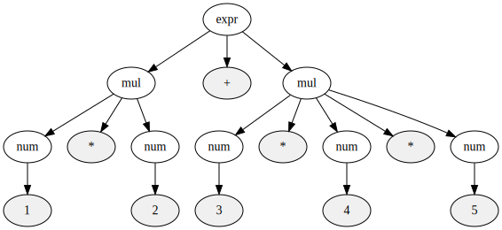

# 將文法結構表示為樹（tree）

實作程式語言的分析器時，輸入為扁平的標記列，而輸出為表示巢狀結構的樹式非常常見的作法。本書的構造也是如此。

C語言的if或while文法可以是巢狀的，自然是適合用樹結構來表現這樣的架構。

算式中，有括號內必須先計算、先乘除後加減的結構。這樣的結構乍看之下可能不像樹結構，但是用樹來表示的話可以非常簡單地代表算式的結構。舉例來說 `1*(2+3)`可以想成用底下的樹來表示：

我們從最邊緣照順序開始計算的話，上述的樹，可以代表`1`乘上`2+3`的算式。也就是說，上述的樹是以樹的結構代表了 `1*(2+3)`的具體計算順序。

